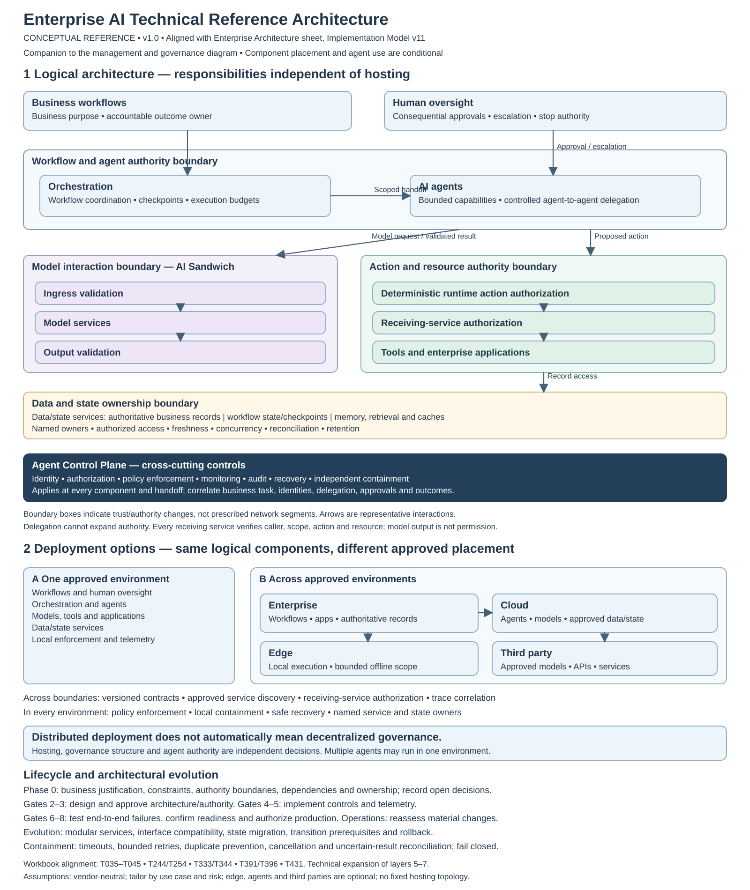

# Enterprise AI Implementation Reference Model — Version 11

Version 11 of the Enterprise AI Implementation Reference Model covers the same 450 tasks across portfolio strategy, governance, delivery, security, and operations. It adds **distributed architecture as a possible option**, not a requirement. The lifecycle, the eight decision gates, and the approval authorities are unchanged.

## Files in this folder

| File | Description |
|---|---|
| [Implementation Guide](Enterprise_AI_Implementation_Reference_Model_v11_Implementation_Guide.docx) | A practical method for tailoring, executing, governing, and maintaining the 450-task reference model for a specific implementation. |
| [Technical Reference Architecture](Enterprise_AI_Technical_Reference_Architecture_v1.svg) | Conceptual, vendor-neutral view (v1.0) of the logical architecture and deployment options. A companion to the management and governance diagram. |

## Focus of Version 11

Version 11 treats distribution as a conditional architectural choice:

- **Three separate decisions.** Logical architecture, deployment placement, and governance structure are recorded independently. Distributed deployment does not automatically mean decentralized governance, and location does not change authority.
- **Phase 0 readiness for distribution.** Compare a centralized baseline with a candidate distributed option against a specific business need, and record constraints, trust and data boundaries, dependencies, proposed owners, and open decisions.
- **Identity and delegation.** Distinct service identities, receiving-service authorization, bounded delegation, revocation, and outage behavior. Delegation cannot expand authority.
- **State and memory ownership.** Authoritative records, workflow state, shared memory, retention, and reconciliation.
- **Interrupted workflows.** Timeouts, bounded retries, duplicate prevention, cancellation, and compensation.
- **Production and change evidence.** Support and incident ownership, traceability, containment, and recovery across boundaries; hosting, supplier, interface, data, and delegation changes trigger a materiality review.

Foundational centralized controls still apply. Distribution-specific work follows the actual system boundaries.

## About the workbook

The full Version 11 workbook and the Version 10 to Version 11 change log are maintained privately. The implementation guide describes how the model is structured and used.

## Earlier versions

Version 10 is archived in [`model/archive/v10/`](../archive/v10/README.md).

## Revisions

- 2026-10-02: CSA AICM source reference in Section 11 of the implementation guide corrected to v1.1 (the version CSA publishes). File name and content otherwise unchanged.

## Important note

The model is a reference, not a universal mandate. Its activities and illustrative dates must be tailored to each implementation. Framework citations explain the design basis; they do not, by themselves, establish legal obligations. This material is educational and professional, not legal advice.
